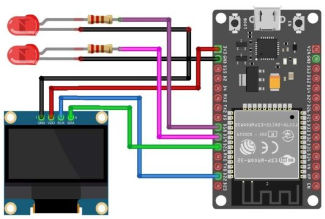
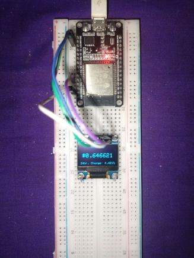

# VerusESP32-PriceTicker

This is a fun little, but also useful project that is meant to track the price of veruscoin crypto currency on a small little microcontroller.

## Information on ESP32

The ESP32 is a low-cost, low-power system-on-a-chip (SoC) microcontroller that is widely used for building IoT (Internet of Things) devices. It was developed by Espressif Systems, a Chinese company that specializes in Internet of Things (IoT) solutions.

The ESP32 chip features two cores, both running at up to 240 MHz, and supports Wi-Fi and Bluetooth connectivity. It also includes a variety of built-in peripherals, such as SPI, I2C, UART, and ADC, making it a versatile and powerful microcontroller for a wide range of applications.

With its low cost, low power consumption, and versatile capabilities, the ESP32 has become a popular choice for building IoT devices, including sensors, controllers, and other smart devices.

## Setup

- To get started just open up the code inside the VerusCoinTicker folder. Then select the board. Install the below libraries from the manage libraries (library manager)
- Go to `sketch > include libraries > manage library`
  - Install `ArduinoJson`
  - Install `Adafruit_SSD1306`
- After the first step, You need to configure the wifi settings, Just change the `SSID` which is Line no 20 and `PASSWORD` on Line no 21 to your router's wifi name and password credentials.
- Then, select the port and upload the code! Note that when you are uploading the code, It says `connecting....______....` in the terminal. You should hold the Boot button on ESP32 to get the board to connect.

## Optional Settings

- You can switch the boot screen from the animation to a single logo in the code. If you dont like the animation to be played, you can just change the `useLogoAsBoot` which is in Line no 23 from `false` to `true`.

## Wiring Diagram

- You can add the lights to know when the price is dropped or increased.

## Images

https://user-images.githubusercontent.com/97907864/234847692-af4123a3-300b-4a42-81b3-ec8ca1c714eb.mp4

## Updates

* Added Balance fetching and feature that calculates how much the balance is worth in usd
* Added Verus Price Graph

## Note

- The Price graph only shows the price chart in INR, USD and BTC Graphs do not work as verus is worth less than a dollar the board is unable to divide 0 price and hence can't plot the graph therefore throws an error restarting the board. You can change the ApiEndpoint url at the top of the code to something which has more than a dollar of price. Also the prices are taken from Coingecko API, the board is the one which calculates everything and plots it and then displays it on the screen. So don't expect the chart to be 1:1 exact as it is in the Coingecko verus page. Although it looks very very similar, there is a slight change in the graph on the board.

## Intention

As a Crypto Miner, Developer and Enthusiast, I know how important it is to track the price of crypto. Thats why i made this project. Hope you like it!
